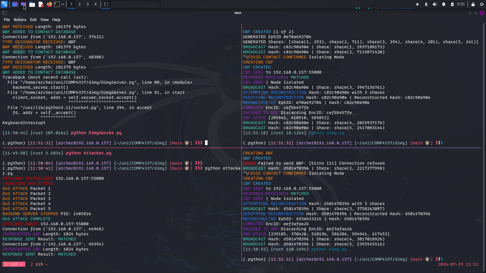

# dimy
did i meet you tracing protocol.  

## Bloom

Simple Bloom Filter implementation  

## BFMan

Bloom Filter Manager
- Uses a circular buffer to rotate Daily Bloom Filters  
- Manages the creation and rotation of Query Bloom Filters  

## Dimy

Did I Meet You Protocol Node
- Generates an Ephemeral ID using the elliptical curve Diffie-Hellman key exchange algorithm  
- Splits the Ephemeral ID into shares, distributes the shares + hash of Ephemeral ID over UDP using shamirs secret sharing  
- Receives shares from other nodes  
- Reconstructs shares if num_shares > req_shares to reconstruct a secret  
- Hashes the ephemeral ID to confirm the received ID hashes to the same hash that was received  
- Generates a private key from the Ephemeral ID using a HMAC Key Derivation Function  
- Generates a shared Encounter ID using the private key + Ephemeral ID  
- Encodes the Encounter ID into a Daily Bloom Filter (DBF)  
- Stores a set of Daily Bloom Filters as a Query Bloom Filter (QBF)  
- Uploads Query Bloom Filters to the DimyServer  
- Can trigger a Contact Bloom Filter (CBF)  

## DimyServer

Back-end Server, stores QBFs to check against received CBFs
- CBFs are triggered by signal interrupt (Ctrl-\\) 
- CBFs and QBFs are preceded by a Type Designator packet
- The back-end uses this packet Type Designator to distinguish a CBF from a QBF  
- The server pads a CBF to be the same length as the QBF it compares to
- The comparator only regards 1-bits, with a 10% match indicating a 'close contact' with COVID-19  

## ThreadSafeSocket

ThreadSafe TCP socket, enabling sequential processing of data with no loss due competition on ports  

## Attacker

MiTM Attacker
- uses a Denial of Service Attack to disrupt the DimyServer
- Binds to the same IP/Port as the Backend
- Intercepts all CBFs/QBFs and returns a positive match in all cases
- Forces nodes into isolation
- Can be hardened against using a checksum to validate Server/Node interactions
